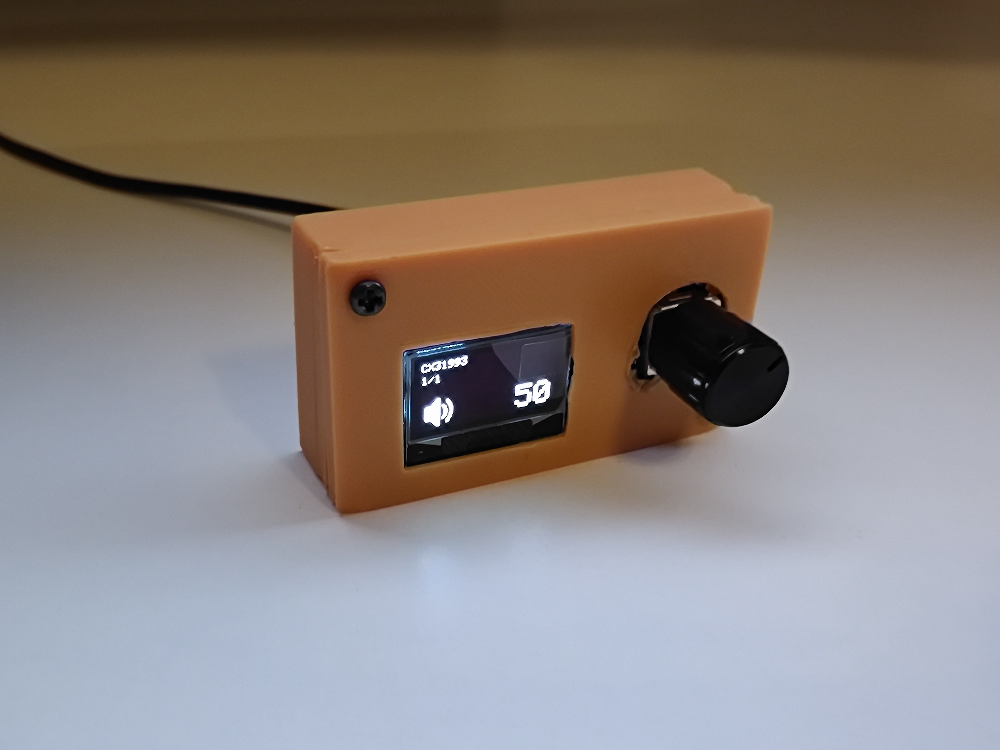
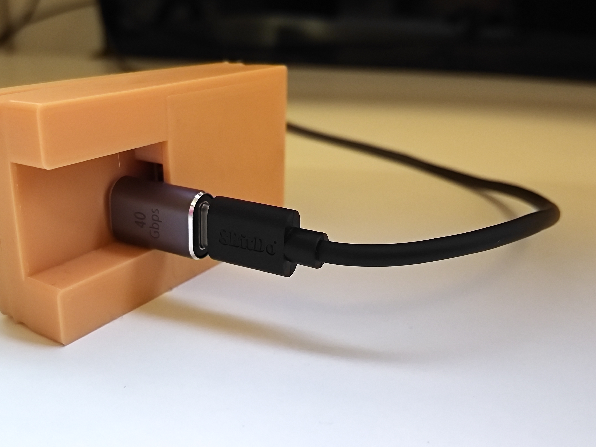
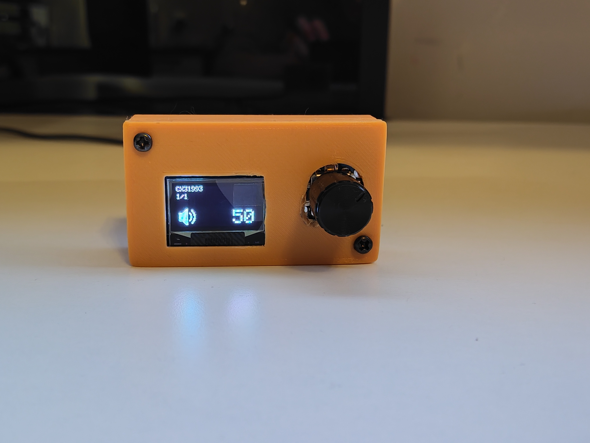

# Lumin-Bridge

Lumin Bridge addresses a common frustration among users of modern monitors—difficult or even impossible brightness control, especially with HDR. This work presents a hybrid solution that combines a physical hardware controller with a Windows application to deliver fast, intuitive brightness and audio control. Built with ESP32 and a Windows desktop app, the system bridges the gap between the user and a computer.

## Photos

